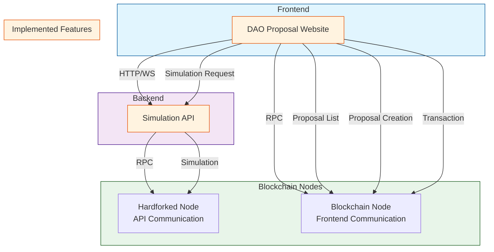

# DAO Community Version

## System Architecture



## Overview
This project implements a DAO (Decentralized Autonomous Organization) system with proposal management, voting, and execution capabilities. The system allows community members to create proposals, simulate their execution, and vote on them.

## Features

### 1. Proposal Management
- **Proposal Creation**
  - Create on-chain and off-chain proposals
  - Support for different proposal types (parameter changes, contract upgrades, etc.)
  - Rich text editor for proposal description
  - Attachment support for additional documents

- **Proposal Simulation**
  - Pre-execution simulation of proposal effects
  - Gas cost estimation
  - State change preview
  - Impact analysis on system parameters

- **Proposal Submission**
  - Multi-step submission process
  - Validation of proposal parameters
  - Preview before final submission
  - Transaction confirmation and status tracking


## Development Details

### Tech Stack
- Frontend: Next.js, React, TypeScript
- Smart Contracts: Solidity
- Web3: wagmi, viem
- UI: Tailwind CSS, shadcn/ui

### Smart Contract Architecture
1. **DAO Committee Proxy**
   - Main governance contract
   - Proposal creation and management
   - Voting mechanism
   - Execution control

2. **Agenda Manager**
   - Agenda tracking
   - Status management
   - Voting period control
   - Execution scheduling

### Key Components
1. **Proposal Creation Flow**
   ```typescript
   // Example of proposal creation process
   const createProposal = async (proposalData) => {
     // 1. Validate proposal data
     // 2. Simulate execution
     // 3. Submit to blockchain
     // 4. Track status
   };
   ```


## Testing

### Local Development Setup
1. Clone the repository
   ```bash
   git clone [repository-url]
   cd dao-community-version
   cd sample-2
   ```

2. Install dependencies
   ```bash
   npm install
   ```

3. Set up environment variables
   ```bash
   cp .env.example .env.local
   # Edit .env.local with your configuration
   ```

4. Start local development server
   ```bash
   npm run dev
   ```

### Testing Proposals

1. **Creating a Proposal**
   - Navigate to "New Proposal" page
   - Fill in proposal details:
     - Title
     - Description
     - Type (on-chain/off-chain)
     - Parameters
   - Click "Simulate" to preview effects
   - Review simulation results
   - Submit proposal

2. **Simulating Proposal Effects**
   - Use the simulation panel to:
     - Preview parameter changes
     - Estimate gas costs
     - Check state changes
     - Verify execution conditions


### Contract Testing

1. **Unit Tests**
   ```bash
   npm run test
   ```

2. **Integration Tests**
   ```bash
   npm run test:integration
   ```

3. **Gas Optimization Tests**
   ```bash
   npm run test:gas
   ```

## Deployment

### Prerequisites
- Node.js v16+
- MetaMask or compatible Web3 wallet
- Access to Ethereum network (Mainnet/Testnet)

### Deployment Steps
1. Build the project
   ```bash
   npm run build
   ```

2 Deploy frontend
   ```bash
   npm run deploy:frontend
   ```

3 Run on local
   ```bash
   npm run dev
   ```

## Contributing
1. Fork the repository
2. Create feature branch
3. Commit changes
4. Push to branch
5. Create Pull Request

## License
[License Type] - See LICENSE file for details