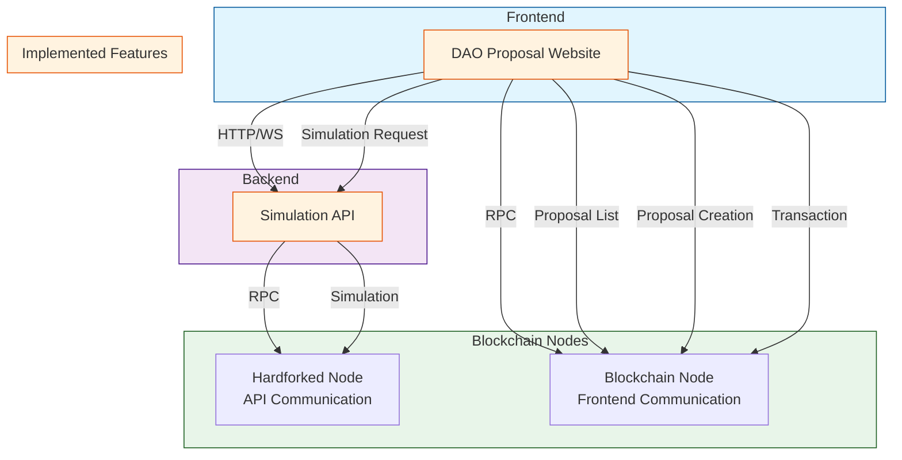

# DAO Community Version

## System Architecture



## Overview
This project implements a DAO (Decentralized Autonomous Organization) system with proposal management, voting, and execution capabilities. The system allows community members to create proposals, simulate their execution, and vote on them.

## Features

### 1. Proposal Management ✅
- **Proposal Creation** ✅
  - Create on-chain proposals
  - Support for different proposal types
  - Rich text editor for proposal description
  - Attachment support for additional documents

- **Proposal Simulation** 🚧
  - Pre-execution simulation of proposal effects
  - Gas cost estimation
  - State change preview
  - Impact analysis on system parameters

- **Proposal Submission** ✅
  - Multi-step submission process
  - Validation of proposal parameters
  - Preview before final submission
  - Transaction confirmation and status tracking

## Development Details

### Tech Stack ✅
- Frontend: Next.js, React, TypeScript
- Smart Contracts: Solidity
- Web3: wagmi, viem
- UI: Tailwind CSS, shadcn/ui

### Smart Contract Architecture ✅
1. **DAO Committee Proxy**
   - Main governance contract
   - Proposal creation and management
   - Voting mechanism
   - Execution control

2. **Agenda Manager**
   - Agenda tracking
   - Status management
   - Voting period control
   - Execution scheduling

### Key Components ✅
1. **Proposal Creation Flow**
   ```typescript
   // Example of proposal creation process
   const createProposal = async (proposalData) => {
     // 1. Validate proposal data
     // 2. Simulate execution
     // 3. Submit to blockchain
     // 4. Track status
   };
   ```

## Testing

### Local Development Setup ✅
1. Clone the repository
   ```bash
   git clone [repository-url]
   cd dao-community-version
   cd sample-2
   ```

2. Install dependencies
   ```bash
   npm install
   ```

3. Set up environment variables
   ```bash
   cp .env.example .env.local
   ```

   Required environment variables:
   ```
   # Blockchain
   NEXT_PUBLIC_RPC_URL=your_rpc_url
   NEXT_PUBLIC_CHAIN_ID=your_chain_id

   # Contract Addresses
   NEXT_PUBLIC_DAO_COMMITTEE_PROXY=your_proxy_address
   NEXT_PUBLIC_AGENDA_MANAGER=your_manager_address

   # GitHub (for metadata)
   GITHUB_TOKEN=your_github_token
   GITHUB_REPO=your_repo_name
   GITHUB_OWNER=your_username
   ```

4. Start local development server
   ```bash
   npm run dev
   ```

### Testing Proposals ✅

1. **Creating a Proposal**
   - Navigate to "New Proposal" page
   - Fill in proposal details:
     - Title
     - Description
     - Type (on-chain/off-chain)
     - Parameters
   - Click "Simulate" to preview effects
   - Review simulation results
   - Submit proposal

2. **Simulating Proposal Effects** 🚧
   - Use the simulation panel to:
     - Preview parameter changes
     - Estimate gas costs
     - Check state changes
     - Verify execution conditions

### Contract Testing ✅
```bash
npm run test
```

## Deployment

### Prerequisites ✅
- Node.js v16+
- MetaMask or compatible Web3 wallet
- Access to Ethereum network (Mainnet/Testnet)
- GitHub account for metadata management

### Deployment Steps ✅
1. Build the project
   ```bash
   npm run build
   ```

2. Run on local
   ```bash
   npm run dev
   ```

## Contributing
1. Fork the repository
2. Create feature branch
3. Commit changes
4. Push to branch
5. Create Pull Request

## License
[License Type] - See LICENSE file for details

# Agenda Metadata Registration Guide

## Repository Structure
```
agendas/
  ├── 123.json  # Metadata for agenda ID 123
  ├── 124.json
  └── README.md  # PR guidelines
```

## PR Title Format
[Agenda #{id}] Add metadata

## Metadata File Format
- Filename: `{agendaId}.json`
- Location: `agendas/` directory
- Format:
```json
{
  "title": "Agenda Title",
  "description": "Detailed description of the agenda",
  "creator": "0x...", // Agenda creator's address
  "createdAt": 1746973116, // Agenda creation timestamp
  "targets": ["0x...", "0x..."], // Target contract addresses
  "atomicExecute": true // Whether to execute atomically
}
```

## Important Notes
- Only the agenda creator can create a PR.
- Include the agenda creation transaction hash in the PR description.
- The creator address in the metadata must match the agenda creator's address.

## GitHub Action for Validation
```yaml
name: Validate Agenda Metadata PR

on:
  pull_request:
    paths:
      - 'agendas/*.json'

jobs:
  validate:
    runs-on: ubuntu-latest
    steps:
      - uses: actions/checkout@v2

      - name: Validate JSON format
        run: |
          for file in agendas/*.json; do
            if ! jq . "$file" > /dev/null 2>&1; then
              echo "Invalid JSON format in $file"
              exit 1
            fi
          done

      - name: Validate creator address
        run: |
          # Verify PR author's email matches agenda creator's email
          # Or verify using transaction hash in PR description