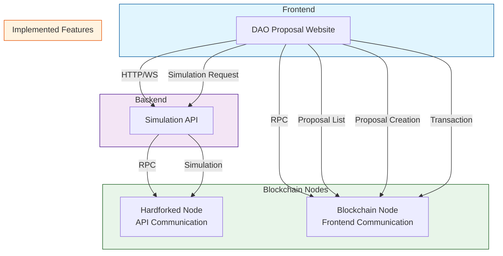

# System Architecture

## Components

### Frontend
- Web application based on Next.js and React
- Type safety using TypeScript
- UI implementation with Tailwind CSS and shadcn/ui
- Web3 integration using wagmi and viem

### Backend
- Serverless backend using Next.js API Routes
- Simulation API provision
- Communication with hardforked node

### Blockchain
- Communication with main blockchain node
- Simulation through hardforked node
- Smart contract interaction

## Smart Contract Architecture

### DAO Committee Proxy
- Main governance contract
- Proposal creation and management
- Voting mechanism
- Execution control

### Agenda Manager
- Agenda tracking
- Status management
- Voting period control
- Execution scheduling
