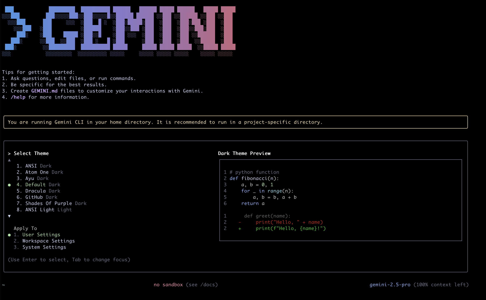
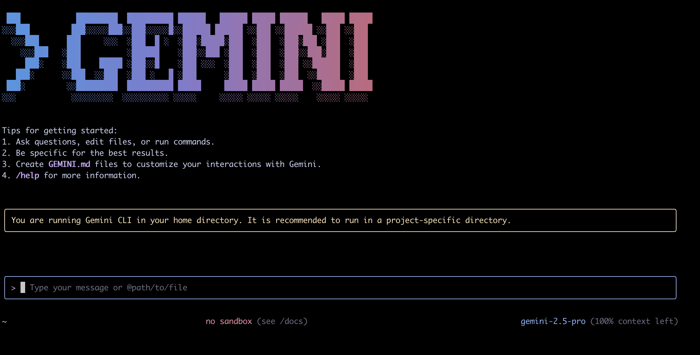

# Install Gemini Cli
To install Gemini CLI, you must first have Node.js installed. Then, you can install Gemini CLI using npm, or run it once using npx. After installation, you will need to authenticate with your Google account.

## Step 1: Install Node.js
Download and install the latest version of Node.js from the Node.js official website.
- Download nodejs: https://nodejs.org/en/download (over v22.17.1 LTS)
Download and install according to your environment.

After installation, enter the node -v command in the terminal to check if the Node.js version is displayed normally.

## Step 2: Install Gemini CLI
Install Gemini CLI from your terminal.

- Global installation using npm (recommended):
```sh
npm install -g @google/gemini-cli
gemini --version
```

- One-time execution using npx:
```sh
npx @google-gemini/gemini-cli
```
This method allows you to run the CLI only when needed without a global installation.


## Step 3: Google Account Authentication
After installation, when you enter the gemini command for the first time, the settings screen will appear first.

```sh
gemini

```



- Select a theme: Use the arrows to move to each theme, and coding style examples will appear on the right, so choose according to your preference.

- Select a project authentication method: There are Google login, Gemini APY Key, and Vertex AI, but let's choose Google login as it is the easiest.

Now you can use gemini.




- Some commands
    - /bug: Submit bugs and issues
    - /chat: Save chat history (save), resume (resume), list (list)
    - /clear: Clear terminal screen (shortcut: Ctrl+L)
    - /compress: Briefly summarize entire chat
    - /editor: Select editor to use
    - /help: Show help information
    - /mcp: List configured Model Context Protocol (MCP) servers and tools
    - /memory: Manage AI's learning memory (GEMINI.md) (add, show, refresh)
    - /restore: Restore files to their state before running the tool.
    - /stats: Show statistics for the current session (token usage, etc.)
    - /theme: Change the visual theme of the CLI.
    - /auth: Change the authentication method.
    - /about: Show version information.
    - /tools: Show a list of available tools.
    - /quit or /exit: Exit the CLI

